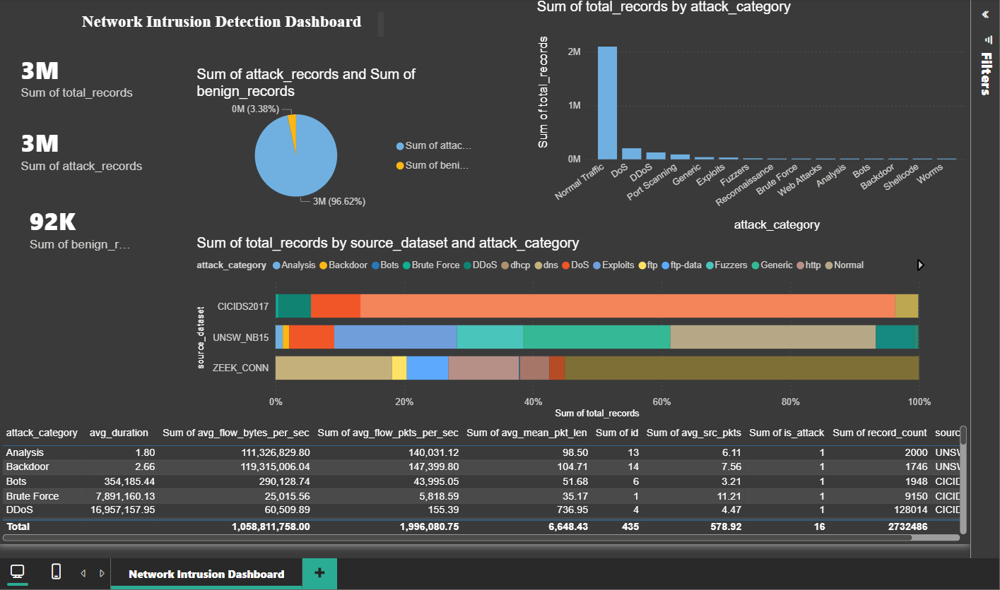

# Network Intrusion Detection — Big Data ETL Pipeline

## Project Overview

This repository implements a network intrusion detection ETL pipeline for cybersecurity analytics. It covers:
- raw data extraction from network traffic logs and benchmark datasets
- PySpark-based cleaning and transformation
- DuckDB ingestion and analytical view creation
- Airflow orchestration for scheduled execution
- dashboard-ready data for Power BI / Tableau

The main datasets are CICIDS2017 and UNSW-NB15, and the goal is to support attack detection analysis through aggregated views and visual reporting.

## Repository Structure

- `Data/` — source datasets, raw staging, and transformed outputs
- `PySpark/` — notebooks for extract, transform, and load steps
- `duck_db/` — DuckDB database files and schema setup
- `Airflow/` — DAG definition for ETL orchestration
- `Dashboard/` — Power BI artifacts and dashboard screenshots

## Architecture

```
Raw Data
  ├── Data/cicids2017_cleaned.csv
  ├── Data/UNSW_NB15_training-set.parquet
  └── Data/conn (1).log
        │
        ▼
  PySpark notebooks
  → extract transformed staging data
        │
        ▼
  PySpark notebooks
  → transform unified dataset + summary aggregates
        │
        ▼
  DuckDB load
  → create tables and views for analytics
        │
        ▼
  Airflow DAG
  → orchestrate extract → transform → load
        │
        ▼
  BI Dashboard
  → visualise attack metrics and distributions
```

## Dependencies

Install the required Python packages before running the notebooks and Airflow DAG.

```bash
pip install pyspark duckdb pandas pyarrow jupyter nbconvert apache-airflow
```

## How to Run

### Manual execution

Run the notebooks in order to execute the pipeline end to end.

```bash
jupyter nbconvert --to notebook --execute --inplace PySpark/exrtract.ipynb
jupyter nbconvert --to notebook --execute --inplace PySpark/transform.ipynb
jupyter nbconvert --to notebook --execute --inplace PySpark/load.ipynb
```

### Run with Airflow

1. Set `AIRFLOW_HOME` and initialize the database

```bash
export AIRFLOW_HOME=$(pwd)/airflow_home
airflow db init
```

2. Create an admin user

```bash
airflow users create --username admin --password admin --firstname Admin --lastname User --role Admin --email admin@example.com
```

3. Copy the DAG into Airflow

```bash
mkdir -p $AIRFLOW_HOME/dags
cp Airflow/dag.py $AIRFLOW_HOME/dags/
```

4. Start scheduler and webserver

```bash
airflow scheduler &
airflow webserver --port 8080
```

5. Open `http://localhost:8080` and trigger `network_intrusion_etl`.

## Dashboard

Use Power BI or Tableau to connect to `duck_db/network_intrusion.duckdb`.
Recommended analytical views:

- `v_dataset_overview`
- `v_attack_distribution`
- `v_top_attack_categories`

### Dashboard screenshot



## Notes

- The notebook filenames match the repository names exactly.
- `duck_db/setup.sql` defines the DuckDB schema and analytical views.
- `Airflow/dag.py` is the orchestration entry point for scheduled ETL.
